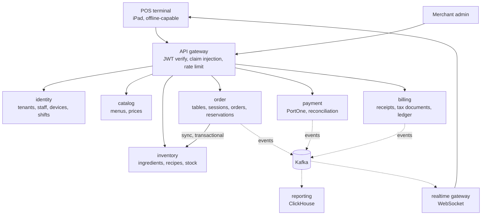

# CloudPos

Multi-tenant restaurant point-of-sale SaaS. Built to run one restaurant or ten thousand,
with tenant isolation enforced by the database rather than by application code.

Java 21 · Spring Boot 3.5 · PostgreSQL 17 · Kafka · ClickHouse · React · Kubernetes

---

## What this is

A production-shaped POS platform for restaurants: menus and recipes, floor plans and
table sessions, orders and kitchen status, reservations, payments, tax documents and
settlement — designed as eight services with real integrations rather than mocks.

The project exists to answer engineering questions the way they are answered at work:
with capacity estimates, written trade-offs, tests that prove the hard guarantees, and
rejected options recorded alongside the chosen ones. The decisions live in
[`docs/adr/`](docs/adr/README.md).

## Current status

**Phase 1 — identity and access.** Complete on the backend.

| Capability                                                                 | State      |
| -------------------------------------------------------------------------- | ---------- |
| Pooled multi-tenancy with PostgreSQL Row-Level Security                    | done       |
| Tenant provisioning and store management                                   | done       |
| Device registration, one-time pairing, credential revocation               | done       |
| Staff PIN authentication (Argon2id) with lockout                           | done       |
| JWT access tokens (RS256, JWKS) and refresh rotation with reuse detection  | done       |
| Role-based authorization and manager approval tokens                       | done       |
| Shift lifecycle with business-day calculation                              | done       |
| API gateway: token verification, claim injection, per-tenant rate limiting | done       |
| Catalog, orders, tables, reservations                                      | phase 2    |
| Inventory with recipe deduction, Kafka, outbox                             | phase 3    |
| Payments (PortOne), tax documents, settlement                              | phases 5–6 |
| POS terminal with offline sync                                             | phase 7    |

52 tests, all against a real PostgreSQL via Testcontainers. No H2: the guarantees this
system depends on — row-level security, exclusion constraints, lock behaviour — do not
exist there, so a test that passes on H2 would prove nothing.

## Architecture



Services are split by **load shape, failure domain and compliance scope** — not by domain
noun. Table, reservation and kitchen state live inside `order` because they share one
invariant, and two services owning one invariant is how double-bookings happen
([ADR 0003](docs/adr/0003-service-decomposition.md)).

## Three decisions worth reading first

**Tenancy is enforced by PostgreSQL, not by `WHERE` clauses.**
Every tenant table has RLS with `FORCE`, and `tenant_id` leads every primary key and
index. Repositories take no tenant parameter at all — a forgotten predicate cannot become
a cross-tenant leak, because the database refuses regardless. A build-breaking test suite
proves it on every commit. Schema-per-tenant was rejected: 10,000 schemas means running
every migration 10,000 times per release
([ADR 0004](docs/adr/0004-multi-tenancy-pooled-with-rls.md)).

**Stock deduction is synchronous; almost everything else is not.**
Money and stock are never eventually consistent inside a single business operation.
Routing stock deduction through Kafka would produce oversell, so `order → inventory` is a
synchronous call inside the order transaction, and the resulting event feeds only
projections and reporting
([ADR 0010](docs/adr/0010-orchestrated-sagas.md)).

**A transactional method that records a failure must not throw.**
Incrementing a failed-PIN counter and then throwing rolls the increment back, so lockout
never engages. The same bug then appeared in refresh-token revocation. Both were caught
by tests, and the pattern is now a written rule with a list of every place it will recur
([ADR 0020](docs/adr/0020-write-then-fail-pattern.md)).

## Running it

Requires JDK 21 and Docker.

### Windows (PowerShell)

```powershell
winget install EclipseAdoptium.Temurin.21.JDK
winget install Docker.DockerDesktop

.\make.ps1 up.core
.\make.ps1 run.identity
.\make.ps1 run.gateway
```

### macOS / Linux

```bash
brew install --cask temurin@21
make up.core
make run.identity
make run.gateway
```

Local ports are deliberately non-standard — PostgreSQL on 5435, Redis on 6380 — so the
stack never collides with other projects. Override with `POSTGRES_PORT`, `REDIS_PORT`,
`KAFKA_PORT` or `CLICKHOUSE_PORT`.

Never bring up the whole stack. Compose profiles exist so that working on one service
needs three containers, not fifteen
([ADR 0018](docs/adr/0018-local-development-environment.md)).

### Trying it out

```powershell
$body = '{"tenant_name":"Seoul Kitchen","store_name":"Gangnam Branch"}'
$tenant = Invoke-RestMethod -Method Post -Uri http://localhost:8081/v1/platform/tenants `
    -Body $body -ContentType "application/json"

$tenant.id
```

Register a device and pair it, hire a staff member, then log in through the gateway at
`http://localhost:8080/v1/auth/login`. The full flow is in
[`contracts/openapi/identity.yaml`](contracts/openapi/identity.yaml).

## Layout

| Path                              | Contents                                                    |
| --------------------------------- | ----------------------------------------------------------- |
| [`contracts/`](contracts)         | OpenAPI documents and event schemas — the source of truth   |
| [`libs/`](libs)                   | `tenancy` (RLS binding), `security`, `web`, `ids`           |
| [`services/`](services)           | `gateway`, `identity` — six more across phases 2–8          |
| [`infra/compose/`](infra/compose) | Profiled local environment                                  |
| [`docs/`](docs)                   | Architecture, domain model, contracts, conventions, 21 ADRs |

## Documentation

| Document                                     | What it covers                                          |
| -------------------------------------------- | ------------------------------------------------------- |
| [Architecture decisions](docs/adr/README.md) | 21 ADRs. Start with 0003, 0004, 0008, 0020              |
| [Architecture](docs/architecture.md)         | Capacity model, stack, security scope, SLOs             |
| [Domain model](docs/domain-model.md)         | Aggregates, invariants and schema per service           |
| [Contracts](docs/contracts.md)               | Event catalog, API conventions, offline sync contract   |
| [Build plan](docs/build-plan.md)             | Phase map and commit discipline                         |
| [Code conventions](docs/code-conventions.md) | Package layout, file taxonomy, naming                   |
| [Design analysis](docs/design-analysis.md)   | UI kit breakdown: 91 screens, tokens, domain vocabulary |

## Design credit

The visual design is the **CloudPos Point of Sale UI Kit by AJP Design**. Architecture,
implementation, database design and all backend work in this repository are original.
